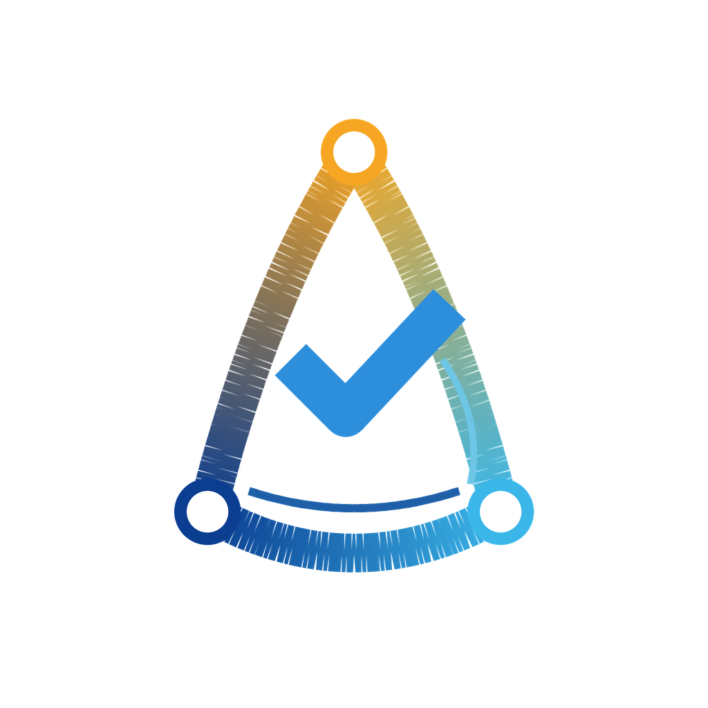

# 또니랑 (Ddonilang)

> 게임과 AI 시대를 위한 **한국어 네이티브 프로그래밍 언어·도구**  
> **결정성(재현)**을 “옵션”이 아니라 **문법**으로 만든다.



---

## 프로젝트 개요

또니랑은 “생각이 바로 게임이 되는 언어”를 목표로 하는 **한국어 중심** 언어·도구 프로젝트입니다.

- **한국어 네이티브**: 한글 어순/표현을 코드로 그대로 쓰되, 모호함은 정본화(캐논)로 줄입니다.
- **결정성(Determinism)**: 같은 입력이면 언제 어디서나 같은 결과가 나오도록 설계합니다.  
  게임 버그 재현, 실험 비교, 강화학습 신뢰도를 위해 “재현”을 기본값으로 둡니다.
- **AI 지향 + AI‑aware**: AI가 코드를 만들어도 “믿을 수 있게” 만들기 위해  
  **팩(pack) 테스트 + 정본화 골든 비교 + 리플레이/트레이스**를 함께 설계합니다.
- **교육/창작 친화**: 게임뿐 아니라 수학·물리·경제를 “실험”으로 바꾸는 도구까지 확장합니다.
- **말힘누리(또니랑세상)**: 말(주문)로 세계를 바꾸는 데모/튜토리얼 세계관을 함께 다듬고 있습니다.

## 현재 구현 상태

- **언어/런타임**: Rust 기반 `ddonirang-lang`, `ddonirang-tool`, `teul-cli`로 DDN 문법, 훅 실행, 수식, 보임 rows, current-line 실행을 검증합니다.
- **CLI/WASM parity**: 셈그림 제품 경로는 WASM 실행을 우선하며, 주요 bundle/checker는 CLI와 WASM 출력 일치를 기준으로 회귀를 막습니다.
- **셈그림 작업실**: 웹 UI에서 DDN 예제를 열고 `실행/일시정지/초기화/한마디씩`으로 마디 실행을 확인할 수 있습니다.
- **보개**: console-grid, graph, space2d 보개와 거울/결과표 흐름을 제공합니다. 보개는 보기 계층이며 실행 진실은 DDN 런타임과 거울 기록이 가집니다.
- **예제 rail**: `solutions/seamgrim_ui_mvp/samples/`에 console-grid, space2d 진자, 테트리스, 수식/증명/람다, 미로, 평면 공 튕김 실험 예제가 정리되어 있습니다.

## 작업터 구조 라벨 (Round 1.5 운영)

Workspace 정리는 실경로 대수술보다 **라벨 분리(public/internal/support)** 를 먼저 적용합니다.

- public:
  외부 공개 동선. 공개 최상위 목적축은 `공부하기 / 게임 만들기 / AI 개발`.
- internal:
  구현/검증/개발 동선. 내부 용어는 `고개 / 걸음 / 걸음길 / AGE / 가지 / D-팩 / 솔루션`.
- support:
  handoff/export/report/tmp/skeleton 등 지원 동선.

운영 원칙:
- 새 축을 만들지 않고(예: `pack_public` 신규 정본화 금지), 안내/라벨을 먼저 정리합니다.
- `solutions -> 결과묶음`은 현재 **공개 라벨 설명(explain-only)** 수준으로만 다룹니다.
- `walks`는 걸음길(학습/튜토리얼/고개별 경로) 의미로만 유지하고, catalog/메모성 문서는 이동 후보로 분리합니다.


---

## 왜 만들었나


이 프로젝트는 **초등학교 졸업 전에 “기억으로 남는 작품”을 남기고 싶어서** 1년 동안 준비하며 시작했습니다.

- 파이썬을 배우면서: 할 수 있는 건 많지만, 처음에는 **문법/영어 장벽**이 컸습니다.
- 스크래치를 하면서: 재미있고 쉽지만, 커지면 **복잡도/확장성의 한계**를 느꼈습니다.
- 그래서 선택한 목표:  
  **한국어로 읽히는 언어 + 게임과 공부를 함께 할 수 있는 세계(누리) + AI와 협업**.

지금은 **누나와 함께 ‘셈그림’(움직이는 셈그림)을 실제로 만들며**  
“공부가 되는 창작”이 어떤 느낌이어야 하는지 계속 검증하고 있습니다.

---

## 결정성은 ‘엔진 옵션’이 아니라 ‘문법’입니다

또니랑은 **모호한 해석이 생길 여지**를 문법에서 먼저 줄여요.  
그래서 “사람이 써도, AI가 써도” 같은 의도가 같은 꼴로 수렴합니다.

대표적인 설계 선택:

- **조사 경계 `~`(정본 표기)**: 한국어 조사(을/를, 로/으로 …)의 경계를 코드에서 분명히 드러냅니다.  
  예: `문~을`, `주문~으로`, `나~는`
- **단일 대입 `<-`**: 상태 변경 표기를 하나로 통일합니다.
- **정의 vs 실행(호출) 분리**: 정의는 `:움직씨 = { ... }`, 실행은 `~기 / ~하기` 꼬리로 고정합니다.
- **단일 연결 `해서`**: 여러 동작을 잇는 방식이 하나로 수렴되도록 합니다.
- **계약/가드**: 조건 위반은 “조용히 무시”가 아니라 진단/기록(거울)로 남기는 방향을 택합니다.

---

## 30초 맛보기: 셈그림에서 바로 도는 예제

아래는 현재 셈그림 예제 rail에서 검증되는 아주 작은 DDN입니다.
과거 루트 접두 표기 없이, 작업실에서 바로 실행해 console-grid 보개와 출력 로그를 확인할 수 있습니다.

```ddn
x <- 15.
y <- 8.
합 <- (x + y).

"콘솔 보개 예제" 보여주기.
합 보여주기.
x 보여주기.
y 보여주기.
```

---

## 또니랑의 6원소 계약

또니랑은 “세계”를 아래 6개로 나눠 생각합니다.

| 이름 | 역할 | 한 줄 |
|---|---|---|
| 샘 | 입력 스냅샷 | 모든 행동은 입력에서 시작 |
| 누리 | 세계 상태 | 게임/시뮬레이션의 상태 |
| 이야기 | 규칙·진행 | 왜 바뀌는지 설명하는 층 |
| 보개 | 화면·소리 | 보이는 개(界) — 표현(2D/3D/사운드) |
| 거울 | 기록·리플레이 | 되감기/감사/재현 |
| 슬기 | AI(도움/지킴) | AI가 돕고, 때로는 지킴이 |

---

## AI와의 협업 방식

또니랑은 “AI가 코드를 만들 수 있다”는 사실을 전제로 설계합니다.  
다만 코어를 AI로 비결정화하지 않고, **검증 가능한 흐름**을 만듭니다.

- 사람(나): 의도/설명/기준을 정한다.
- AI: 코드 생성 + 아이디어 제안 + 개선 제안
- **팩(pack) 테스트**: 예제가 정본(골든)을 계속 통과하는지 확인
- **정본화(캐논)**: 표기가 흔들려도 결과가 한 형태로 모이게 함
- **리플레이/트레이스**: 문제 상황을 그대로 재현/복기

---

## aiGYM — 결정적 AI 훈련/실험 환경

aiGYM은 또니랑의 **결정성 기반 훈련/실험 환경**을 말합니다.  
같은 입력·시드로 **항상 같은 결과**를 얻을 수 있어, 학습/비교/디버깅이 쉬운 것이 목표입니다.

- 입력/로그/리플레이를 묶어 **재현 가능한 학습 실험**을 만든다.
- 정책 변경 전후를 **팩(golden)으로 비교**한다.
- 게임·수학·물리·경제 실험을 하나의 **표준 훈련 인터페이스**로 연결한다.

---

## 말힘누리(또니랑누리/또니랑세상) — 주문으로 여는 세계

말힘누리(또니랑누리)는 “말(주문)로 세계를 바꾼다”는 콘셉트의 데모/튜토리얼 세계관입니다.

- 주문(말)을 **자연어에 가까운 코드**로 작성
- 세계(누리) 상태가 **결정적으로 변화**하는 흐름을 보여줌
- 초심자가 “왜 이렇게 동작하는지”를 **거울/리플레이로 확인**

---

## 공부에 도움이 되는 실험실(진행 중)

또니랑은 게임뿐 아니라, **공부를 “실험”으로 바꾸는 도구**도 함께 만들고 있습니다.
현재는 셈그림 작업실을 중심으로 DDN 예제, 보개, 그래프, 거울을 직접 검증하고 있습니다.

### 1) 셈그림 (움직이는 셈그림)
- 수식·도형·물리 법칙을 **‘마디 타임라인’**으로 움직이는 그림으로 실행
- 같은 DDN 코드와 같은 입력이면 같은 보임 rows/거울 기록을 만드는 방향으로 검증
- console-grid, graph, space2d 예제를 작업실에서 바로 확인

### 2) 물리스투디오 (Physics 2D)
- 이론(수식) ↔ 실험(누리) ↔ 그래프(비교)
- 자유낙하/포물선/충돌 같은 개념을 “손으로 만져보는” 실험

### 3) 경제학실험실 (Eco‑Lab)
- 레버(슬라이더)로 정책/시장 실험
- 시장/흐름/관계 뷰 + 되감기(복기)

---

## 로드맵

1. **콘솔 기반 선언적 시뮬레이션**  
   텍스트로 움직이는 세계 (되감기/리플레이 기본)
2. **웹 기반 2D 창작 도구**  
   스크래치 같은 쉬움 + 한국어 블루프린트
3. **셈그림·물리·경제 실험실 + NuriGym**  
   Manim급 표현력 + 결정적 강화학습 환경 + 학습용 스튜디오
4. **다국어 확장**  
   일본어/터키어/몽골어 버전의 문서·예제·튜토리얼을 순차적으로 준비  
   격변화 언어는 “조사 대응”이 아니라 **격표지 정본화**로 접근하는 방안도 고려 중

---

## 공개 채널

- **GitHub**: 코드 + 문서 공개 / 이슈·토론 / 릴리스 태그
- **YouTube**: 3~5분 소개 영상 + 30초 데모 + 로드맵
- **Naver Blog**: 주 1회 개발 일지 + 쉬운 튜토리얼 + 새 데모 공개

---

## 기여(Contributing)

기여를 환영합니다.

- 초심자가 읽기 쉬운 문장/예제 아이디어
- 말힘누리(또니랑누리) 데모용 퀘스트/마법 주문 아이디어
- 셈그림(수학/물리 애니메이션) 장면 아이디어
- 물리스투디오: 자유낙하/포물선/충돌 실험 아이디어
- 경제학실험실: 인플레이션/부의 쏠림 같은 실험 아이디어
- 버그 재현을 위한 팩(pack) 케이스 제보

---

## 감사

이 프로젝트는 **AI와의 협업**을 전제로 추진되었습니다.  
문서 정리, 코드 리팩터링, 테스트 케이스 정리 등을 **AI(Codex, gemini, grok, chatgpt 포함)와 함께** 만들었습니다. 함께한 AI의 노고에 감사드립니다.

---

## 라이선스

- 오픈소스로 공개할 계획입니다. (라이선스는 GitHub에서 공지)

---
